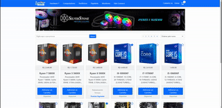

<h1 align="center">
    
</h1>

<h3 align="center">
   <a href="https://lognetinfo.netlify.app/">Online Demo</a>
</h3>

<h4 align="center"> 
    Status: Finalizado✅
</h4>

# Indice

- [Sobre](#-sobre)
- [Tecnologias Utilizadas](#-Tecnologias-utilizadas)
- [Como baixar o projeto](#-Como-baixar-o-projeto)

## 📋 Sobre

O **lognetinfo** é um projeto de e-commerce alternativo da **[Lognet Informática](https://www.lognetinfo.com.br/)**. Com o objetivo de colocar em prática os conhecimentos adquiridos em video aulas e durante o estudo do Bootstrap.

---


## 🚀 Tecnologias utilizadas

O projeto foi desenvolvido utilizando as seguintes tecnologias 

- [HTML](https://www.w3schools.com/html/)
- [CSS](https://www.w3schools.com/css/)
- [JavaScript](https://www.javascript.com/)
- [Bootstrap v5.1.0](https://getbootstrap.com/)


---

## 📁 Como baixar o projeto

```bash

    # Clonar o repositório
    $ git clone https://github.com/orlandolilo/lognetinfo
    
```